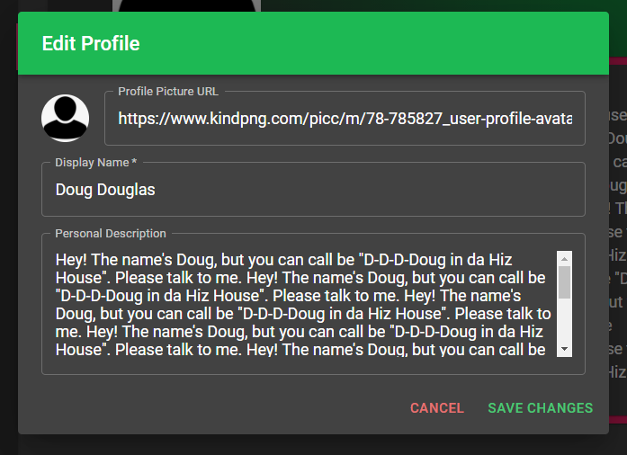

# Getting Started with Meetify

<!-- markdown-toc start - Don't edit this section. Run M-x markdown-toc-refresh-toc -->
**Table of Contents**

- [Installation](#installation)
- [Usage](#usage)
    - [Logging In](#logging-in)
        - [Register](#register)
    - [Navigation Overview](#navigation-overview)
    - [Page Usage](#page-usage)
        - [Meet](#meet)
        - [Matches](#matches)
        - [Intersect](#intersect)
        - [Profile](#profile)
- [Frequently Asked Questions (FAQ)](#frequently-asked-questions-faq)

<!-- markdown-toc end -->

# Installation

To use Meetify locally, you just need to install the GUI to your system via our install scripts or pre-made packages. These _will be_ located under the [Meetify UI Repo releases page](https://github.com/segeeslice/Meetify-UI/releases), but **end-user installation is not yet supported**.

It will also eventually be available as a website at [https://meetify.tech/](https://meetify.tech/) 

In the meantime, if you’re a bit tech-savvy, feel free to read the [Meetify UI main page](https://github.com/segeeslice/Meetify-UI) for development environment instructions.

_Note that Meetify currently only supports computer OS distributions. This means Windows, Linux, or Mac system will be required to run the program._

# Usage

## Logging In

Upon running the program, you should greeted with the following screen:

If you don’t have an account, you will need to click the “**REGISTER**” link underneath the password field. From here, you will need to simply enter in any necessary user data and register your account, linking it with an existing Spotify account for access to the Meetify services. Upon success, you should be redirected to the main page to login.

Once you have an account ready, you can enter your username and password into the applicable text fields and click “**LOGIN**”. If successful, you will be moved to the main page and you can begin meeting people!

### Register

To register, Meetify requires that you provide your email and a valid password. Passwords do not require capitalization or symbols. The only requirement is that the password is at least 10 characters long.

## Navigation Overview

This is what you will see upon first opening the program. Let’s do a quick overview of important areas of the application:

In the yellow box is the “main” application area. This is where you’ll interact with your current page, allowing you to do things like meet new people and chat with existing matches. Right now, it’s on the Meet page _(and this page’s usage will be detailed more later)._

In the blue box are the navigation tabs. Clicking on any of these tab buttons will take you to that respective page, which will be made viewable in the “main” yellow area

These tabs will be detailed more later, but in general, you can travel to:

1. Meet: For meeting new people
2. Matches: For seeing and talking with people you have “matched” with on the Meet page
3. Intersect: For manually intersecting your Liked Songs with another Meetify user’s
4. Profile: For viewing and editing your publicly viewable profile

## Page Usage

### Meet

You’ll first be greeted with this page. Click “**MEETIFY!**” and we’ll search for potential matches. (It may take a while!)

You’ll then see something like this, showing various users with similar music tastes. It’s first useful to note the **refresh button** in the top right corner, allowing you to get a potentially new set of matches from the server at any time!

For further usage, let’s use Dougy doug as an example…

This is a **card** showing one user. This is just a small intro to this person. Here, we can click the red “X” on the left to dismiss this user, or we can click the green “add user” icon on the far right to match with them! If both parties match each other, this will allow you to chat with each other.

Before we decide whether or not to match with someone, we may want to find some more information on them. We can do this by either clicking the user’s display name area or the white “songs” icon, bringing you to a new page:

Here we can see the user’s profile and the songs you have in common. You can switch between these freely by using the tabs in the top right. You can then exit via the “X” in the top right corner of this dialog.

### Matches

This page is where you see your pre-existing matches. This should load automatically, but you can always click the “refresh” button in the top right corner to manually retrieve pre-existing matches from the server.

This is very similar to the “Meet” page. Let’s look again at Dougy doug...

Again, we see the user’s **card**. Like the “Meet” page, we click the red “X” button to dismiss this match, or we can click any of the other action areas to see more details about the match. However, unlike the “Meet” page, we now have a **“chat” button**, allowing us to talk with our match...

Here, you can send messages to and receive messages from the selected user, as well as view your previous conversation history. Again, similar to “Meet”, we can freely switch and also see your common songs and the other user’s profile from this view using the tabs on the top bar, and we can close at any time using the “X” in the top right.

### Intersect

Upon entering another Meetify user’s User ID and clicking “**SUBMIT**”, this page will list the songs you have in common with that user. Note that this feature only uses the **Liked Songs** playlist in Spotify.

### Profile

This is where you’ll see your own, personal account profile, including your profile picture, display name, status, and personal description.

By clicking “**EDIT PROFILE**” in the top right, a new dialog will appear:

Here, you can make changes to your profile. Once you hit **“SAVE CHANGES”**, if everything is valid, your personal profile data will be updated. You can of course hit **“CANCEL”** at any time and no changes will be made.

# Frequently Asked Questions (FAQ)

How do I make an account?

**At the Login page, there is a Register button. Click that, and it will take you through the process of creating an account with Meetify.**

Do I need a Spotify account to use Meetify?

**Yes. If you do not have a Spotify account already, you can make one by visiting Spotify’s website. Creating an account is free.**

Why do I need to link my Spotify account to my Meetify account?

**Meetify uses information about your Spotify account (such as your listening history and saved playlists) to match you with other users with similar music taste.**

Will using this service be a security concern for my Spotify account?

**No. We do not store any of your Spotify credentials, so you don’t have to worry about anyone accessing your account.**

Can I intersect playlists that aren’t my Liked Songs?

**Not right now, but we plan to add this feature on the “Intersect” page.**

What kind of information does Meetify store about me?

**We store only the personal information that you provide to us (first/last name, email, spotify username, location). We also store your liked songs to use for matching you with other users.**

